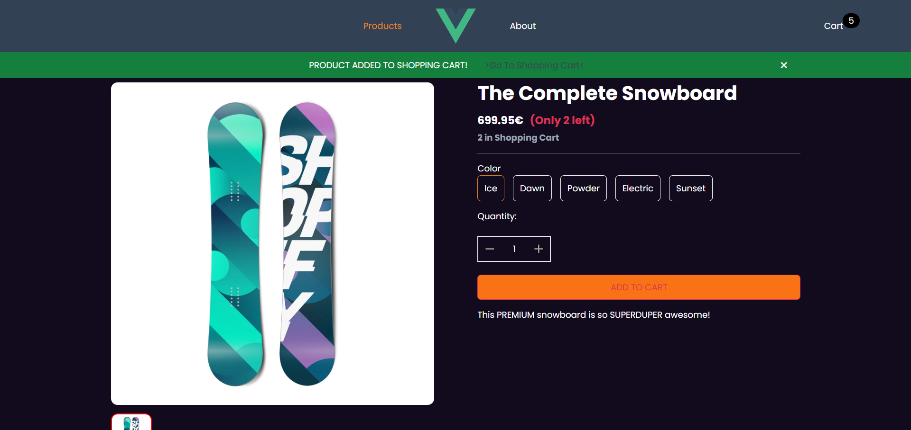

# Vue.js headless E-Commerce Store - Shopify Storefront API

Frontend-SPA for a headless E-Commerce Store with basic functionality. Connected to Shopify GraphQL Storefront API to use Shopify as Backend. Built with Vue 3 and Typescript.

Deployed via Netlify: <a href="https://vuejs-storefront.netlify.app" target="_blank">https://vuejs-storefront.netlify.app</a>



## About this Project

This project is a custom frontend single-page application (SPA) for a headless e-commerce store that uses Shopify as the backend. The frontend is built with Vue.js 3 and Typescript.

The SPA communicates with Shopify's GraphQL Storefront API, which provides access to all the backend operations of the e-commerce store, such as product catalog, cart, checkout and more. The SPA implements basic functionality such as filtering and sorting products, pagination, and adding items to the cart.

Backend-Store mock product data generated with 'Simple Sample Data' Shopify-App.

## Tech

-   Vue 3, Vite, VueRouter
-   Typescript
-   Tailwind CSS
-   Shopify Storefront API (GraphQL)

## Features

-   Mobile First (Responsive Website)
-   basic E-Commerce Features (Products, Sort & Filter, Cart, Inventory Status, redirect to Checkout)
-   paginated Product Fetching (GraphQL Cursor Based Pagination, fetch 250 Products at once, then display products, fetch next page and concatenate to fetched products)
-   SPA-Routing
-   custom urlQueryStringEncoder / Decoder logic for filter, search and page queries (e.g. to share the link for a group of sorted and filtered products, and persist the filter attributes in the URL).
<!-- -   List Products (utilizing GraphQL CoursorPagination (for more than 250 Products in Backend))
    -   with in Stock Status
-   Cart Functionality (Add,Update,Remove)
-   Checkout Functionality through Shopify API -->

## Project Setup

#### 1. Create a shopify store with Storefront API access.

#### 2. Insert your Shopify Storefront API credentials into <strong>'.envExample'</strong> and rename it into <strong>'.env'</strong> to connect the frontend to your store. <em> (Or use the hardcoded variant in <strong>'.\src\utils\graphQLClient.ts'</strong> and fill in your Store credentials there).</em>

It's no problem to hardcode / show the credentials, because they are visible for everyone within the GraphQL request anyway. Security isn't a concern because the Storefront API is built this way and only customer oriented actions like retrieving products, details, managing cart are possible.

This only applies to Storefront API. Admin API credentials should never be public!

### Install dependencies
```sh
npm install
```

### Compile and Hot-Reload for Development

```sh
npm run dev
```

### Type-Check, Compile and Minify for Production

```sh
npm run build
```

## Recommended IDE Setup

[VSCode](https://code.visualstudio.com/) + [Volar](https://marketplace.visualstudio.com/items?itemName=Vue.volar) (and disable Vetur) + [TypeScript Vue Plugin (Volar)](https://marketplace.visualstudio.com/items?itemName=Vue.vscode-typescript-vue-plugin).
